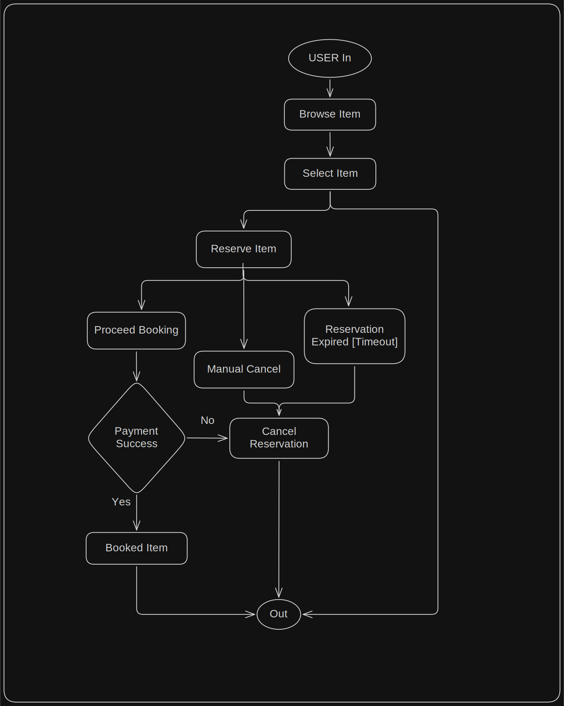

# System Design

This doc contains the system design and decisions of Bookings Management System based on [SRS](srs.md)
## Functional Flow

**Functional flow of system :**
 
### DECISIONS :

**Payment Lifecycle :**

1. If a payment is initiated before the reservation expiry time:
   - the reservation enters "payment in progress" state
   - expiry is suspended during this period
   - if payment succeeds, booking is confirmed even if completion occurs after the original expiry time

3.  If payment **succeeds**, booking is confirmed regardless of the original expiry time.

4. On payment **failure**, the item is still reserved under the user, giving him another chance to proceed payment. Reservation is not cancelled on payment failure as user must not be punished for technical/server failure.
     - reservation remains active
     - user may retry payment

**Reservations :**
1. Timeout = 7 minutes

2. Reservations can either be cancelled manually by user or by expiry (timeout).

3. An item can have at most one **active reservation or confirmed booking** at a time.

---
